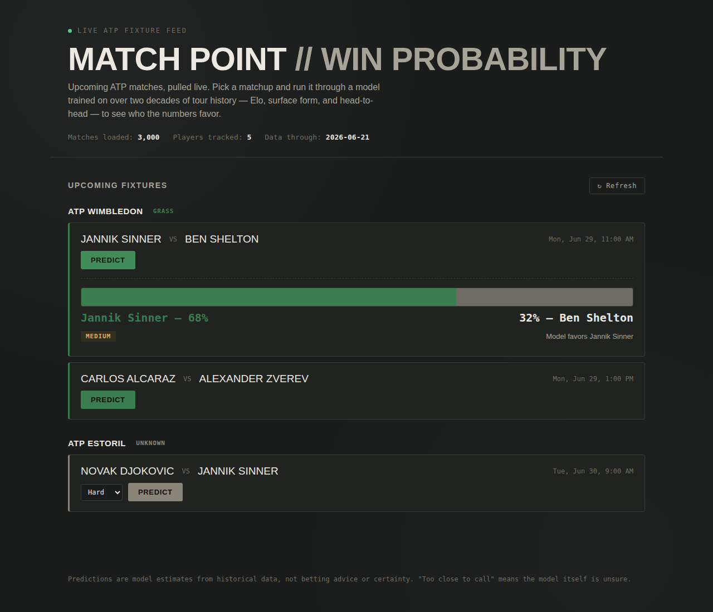
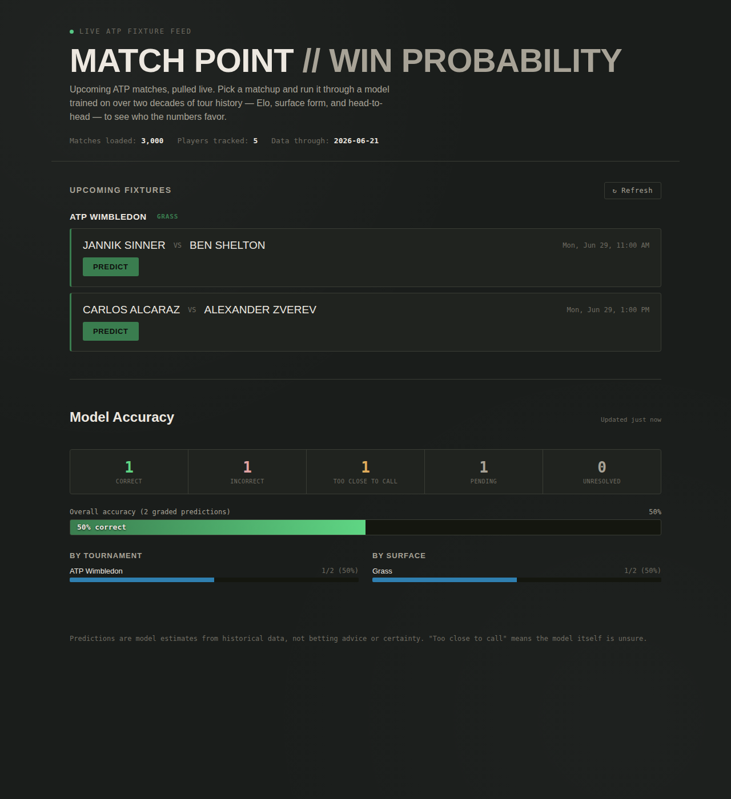
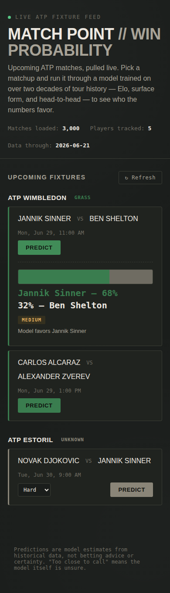

# Match Point — Live ATP Match Prediction Platform

A full-stack machine learning application that predicts ATP tennis match
outcomes using 25+ years of historical match data, serves live upcoming
fixtures, and tracks its own real-world prediction accuracy over time.

```
atp_tennis.csv
      ↓
Feature Engineering (Elo, surface Elo, head-to-head, form, upset rate...)
      ↓
Model (.pkl — Random Forest, compared against Logistic Regression & XGBoost)
      ↓
predict.py  (loads model + replays history → predict_match())
      ↓
FastAPI backend (app.py)
   ├── /predict            — win probability for any matchup
   ├── /fixtures/upcoming  — live ATP fixtures (The Odds API)
   ├── /dashboard/*        — prediction accuracy tracking (SQLite)
      ↓
Frontend (index.html — vanilla HTML/CSS/JS, no build step)
```

## Screenshots

**Live fixture prediction**, with the surface-aware scoreboard reveal:



**Accuracy dashboard**, showing overall/tournament/surface breakdowns:



**Mobile view**:



## What this does

- Predicts the winner of any ATP men's singles matchup using a model
  trained on Elo ratings (overall + surface-specific), head-to-head
  record, recent form (5/10/20-match windows), surface win rate, upset
  tendencies, and tournament context.
- Pulls **live upcoming ATP fixtures** automatically (no manual name
  entry) via [The Odds API](https://the-odds-api.com), with a one-click
  Predict button per match.
- **Tracks every fixture-based prediction** and automatically checks the
  real result once the match finishes, building an honest, ongoing
  accuracy report — overall, by tournament, and by surface.
- Labels predictions with a confidence tier (`High` / `Medium` / `Low` /
  `Too Close to Call`) rather than always picking a side.

## Project structure

```
project files
  predict.py          — core prediction engine (loads model, resolves names, computes features)
  app.py              — FastAPI backend (all HTTP endpoints)
  tennis_fixtures.py  — live fixtures from The Odds API, with caching
  outcome_resolver.py — checks completed match results, grades predictions
  tracking_db.py       — SQLite storage for the accuracy dashboard
  surface_lookup.py    — known tournament → surface table
  tennis_model.pkl, tennis_scaler.pkl, tennis_feature_cols.pkl  — trained model artifacts
  atp_tennis.csv        — historical match data (NOT included in this repo — see Setup)
  requirements.txt
  render.yaml           — Render deployment blueprint
  test_matchups.py      — batch-test script for sanity-checking real matchups

frontend
  index.html           — the entire frontend (no build step, no framework)
  vercel.json          — Vercel deployment config
```

## Setup (local development)

### 1. Backend

```bash
cd app
pip install -r requirements.txt
```

Place your `atp_tennis.csv` in this same `project files` folder (this repo does not
include the dataset itself — see the Data section below).

Copy `.env.example` to `.env` and fill in your API key, **or** set it as a
real environment variable for the current terminal session:

```bash
# macOS/Linux
export ODDS_API_KEY=your_key_here

# Windows PowerShell
$env:ODDS_API_KEY="your_key_here"
```

Get a free key (500 requests/month, no credit card) at
[the-odds-api.com](https://the-odds-api.com).

Run the backend:

```bash
uvicorn app:app --reload --port 8000
```

Visit `http://127.0.0.1:8000/docs` for interactive API documentation
(generated automatically by FastAPI).

### 2. Frontend

In a **separate** terminal:

```bash
cd frontend
python -m http.server 5500
```

Visit `http://127.0.0.1:5500/index.html`. The frontend automatically
points at `http://127.0.0.1:8000` when loaded from localhost — no
configuration needed for local development.

### 3. Quick sanity check

```bash
cd app
python test_matchups.py
```

Edit the `MATCHUPS` list at the top of that file to check any real
current players.

## Data

This repo does **not** include `atp_tennis.csv` (the historical match
dataset). Supply your own ATP match history CSV with these columns:

```
Tournament, Date, Series, Court, Surface, Round, Best of,
Player_1, Player_2, Winner, Rank_1, Rank_2, Pts_1, Pts_2,
Odd_1, Odd_2, Score
```

Player names should be in `Lastname F.` format (e.g. `Sinner J.`,
`Cerundolo J.M.`) — `predict.py`'s name resolver converts full names from
live data sources into this format automatically.

## How the prediction engine works

`predict.py` replays the entire match history in chronological order once
at startup to compute each player's **current** state:

- **Elo rating** (overall, and separately per surface) — K-factor 32,
  starting at 1500
- **Head-to-head record** (overall, and separately per surface)
- **Recent form** over the last 5, 10, and 20 matches
- **Surface-specific career win rate**
- **Upset rate** (win rate when the lower-ranked player) and **collapse
  rate** (loss rate when the higher-ranked player)
- **Elo-vs-rank gap** (flags players whose results outperform their
  official ranking)

These features feed a Random Forest classifier (compared against
Logistic Regression and XGBoost during training — see the project's
training notebooks). A chronological train/test split was used throughout
to avoid lookahead leakage.

### Name resolution

Live data sources give full names (`"Novak Djokovic"`); the dataset uses
abbreviations (`"Djokovic N."`). The resolver converts between these
deterministically:

1. Exact match
2. Case-insensitive exact match
3. **Initials conversion** — tries both Western order (`Juan Manuel
   Cerundolo` → `Cerundolo J.M.`) and surname-first order (`Wu Yibing` →
   `Wu Y.`), checking the dataset's real surname→initials index. Western
   order is checked first and exclusively before surname-first is even
   considered, so an unrelated real player under the other convention
   never falsely contests a confident match.
4. Substring / token-overlap fuzzy matching, as a last resort

Genuinely ambiguous names (e.g. two real players sharing a surname with
matching initials) raise a clear error asking for more specificity,
rather than guessing.

## The accuracy dashboard

Every prediction made against a **real fixture** (one with a `fixture_id`
from `/fixtures/upcoming`) is logged to a local SQLite database
(`tracking.db`). A background job polls The Odds API's `/scores` endpoint
every 30 minutes, automatically detects completed matches, and grades
each tracked prediction as correct/incorrect once the real result is
known. You can also trigger this manually:

```bash
curl -X POST http://127.0.0.1:8000/dashboard/sync
```

**"Too Close to Call" predictions are excluded from the accuracy
percentage** (no call was made, so there's nothing to grade) and reported
as a separate count, so the headline accuracy number always reflects
predictions the model actually committed to.

Ad-hoc predictions (manually typed names, no `fixture_id`) are **never**
tracked — there's no real future outcome to verify them against.

### Known caveat

The Odds API's documentation states `/scores` coverage is "gradually
being expanded" across sports. Tennis coverage was not directly verified
against a live completed match at the time this was built — the resolver
is built defensively (incomplete/malformed data → stays pending or marked
unresolved, never silently guessed), but if you notice predictions aren't
resolving after real matches finish, check a live `/scores` response for
your active tournament's sport_key against `outcome_resolver.py`'s
assumptions.

## Deployment

### Backend → Render

1. Push this repo to GitHub.
2. On [Render](https://render.com), create a new **Blueprint** and point
   it at this repo — it will detect `render.yaml` automatically.
3. Set `ODDS_API_KEY` in the Render dashboard (Environment tab) — never
   commit real keys to the repo.
4. Deploy. Your API will be live at `https://<your-service>.onrender.com`.

**Known limitation:** Render's free tier has an *ephemeral filesystem* —
`tracking.db` is wiped on every redeploy and periodic restarts. This is an
accepted tradeoff for a portfolio/demo project. For persistent tracking
history, add a Render persistent disk (paid) or switch `tracking_db.py` to
a hosted Postgres instance.

### Frontend → Vercel or GitHub Pages

**Vercel:** import the `frontend` folder as a new project — `vercel.json`
is already configured for a static site.

**GitHub Pages:** enable Pages on this repo, pointing at the `frontend`
folder (or copy `index.html` to the repo root, depending on your repo
layout).

**Before deploying either way**, open `frontend index.html` and set:

```js
const DEPLOYED_API_BASE = "https://your-actual-backend-url.onrender.com";
```

This is the one line that needs to change between local development and
production — everything else (CORS, local-vs-deployed detection) is
already handled.

## Roadmap / possible extensions

- WTA (women's tour) support
- Player rankings and head-to-head visualizations in the UI
- Explainable AI — surfacing *why* the model favors a player (e.g. which
  features contributed most to a given prediction)
- Hosted database for tracking history that survives redeploys
- Tournament round/stage data from a richer fixtures source


